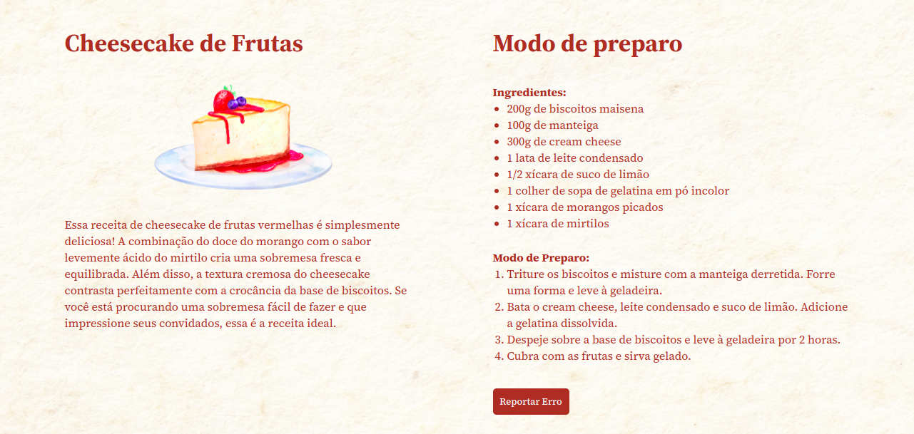

# Receita de Cheesecake de Frutas
Explore um layout encantador que traz uma receita irresistível de **cheesecake de frutas**, com um design moderno e totalmente responsivo. Seja no desktop ou no celular, cada detalhe foi cuidadosamente projetado para proporcionar uma experiência visual agradável e intuitiva. **Prepare-se para ficar com água na boca enquanto navega por uma interface suave e adaptável a qualquer tela!**

## 💻 Layout


## 🔧 Linguagens
- HTML
- CSS

## 🤖 Clonar repositório

1. Clone o repositório:
```bash
  git clone https://github.com/CaioAlves10/explorer-stage-03-cheesecake.git
```

2. Entre no diretório:
```bash
  cd explorer-stage-03-cheesecake
```

<br />

---

<br />

<p align="center">
  Feito com 💙 por Caio Carvalho
</p>